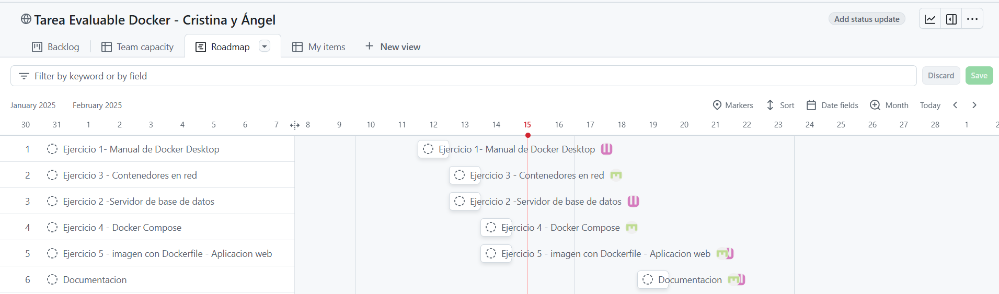

# Asignación de Tareas

> **Autores**: Ángel Villabrille Fernández, Cristina Mellado Malacara.
> 

## Asignación de Tareas

| Responsable | **Tarea** | **Plazo estimado** | **Plazo finalizado** |  **% Completado** |
| --- | --- | --- | --- | --- |
| Cristina | Ejercicio 1 - Manual de Docker | 12-feb-25 | 12-feb-25 | 100% |
| Cristina | Ejercicio 2 - Servidor de BBDD | 13-feb-25 | 13-feb-25 | 100% |
| Ángel | Ejercicio 3 - Contenedores en Red | 13-feb-25 | 13-feb-25 | 100% |
| Ángel | Ejercicio 4 - Docker Compose | 14-feb-25 | 18-feb-25 | 100% |
| Cristina y Ángel | Ejercicio 5 - Imagen con Dockerfile | 14-feb-25 | 17-feb-25 | 100% |
| Cristina y Ángel | Documentación | 19-feb-25 | 19-feb-25 | 100% |

## Roadmap

- Se muestra la previsión inicial que se tiene para la resolución de las tareas.

## Progreso

- Inicialmente cada miembro del equipo aborda una tarea de las asignadas, cambiándola de estado a In Progress.

- Una vez se finaliza la tarea se cambia de estado nuevamente a Done y las siguientes tareas a abordar se cambian a In Progress.

- Cuando se terminen todas las tareas observamos que en el apartado Done están cada una de ellas.

## Conclusión trabajo en grupo.

El trabajo en grupo se desarrolló de manera adecuada. La comunicación entre los dos fue clara y ayudó a cumplir con los plazos establecidos. Aunque hubo tareas que requirieron más tiempo, logramos repartir las responsabilidades de manera equilibrada y avanzar en cada una de ellas. En general, la dinámica fue buena, permitiendo completar el trabajo con los resultados esperados.
