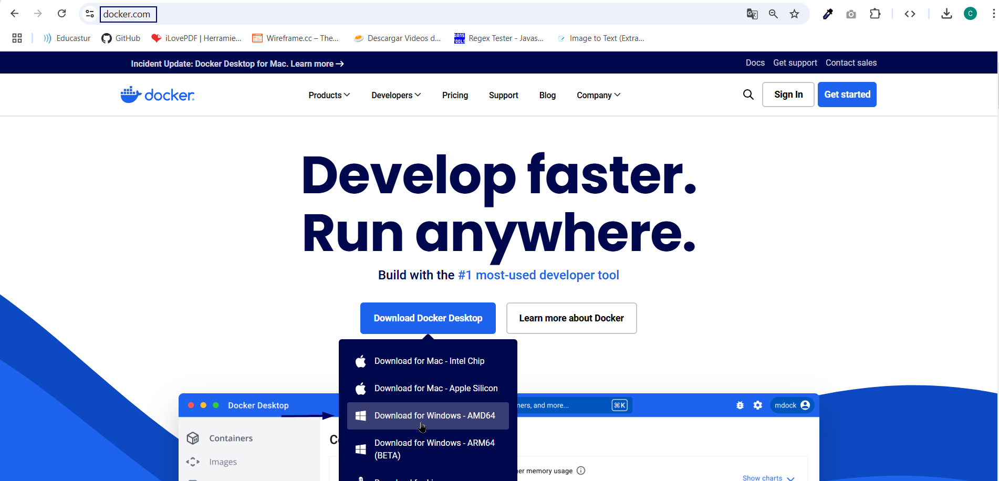

# Ejercicio 1: Manual de Docker Desktop

> **Autores**: Ángel Villabrille Fernández, Cristina Mellado Malacara.
> 

## 1. Introducción

Docker Desktop permite crear y gestionar contenedores de forma sencilla en Windows .Este manual ofrece una guía rápida de uso.

## 2. Instalación de Docker Desktop en Windows

1. Entramos a la página oficial [https://www.docker.com/](https://www.docker.com/)  y hacemos click en Download for Windows-AMD64.



1. Instalar Docker Desktop
- Una vez descargado el archivo `.exe`, lo ejecutamos para comenzar la instalación.
  
    
    
- Seleccionamos ambas opciones.


3. Reiniciamos el sistema

- Tras la instalación y configuración de WSL 2 y Hyper-V, es posible que necesites reiniciar el sistema para que todos los cambios se apliquen correctamente.

## 3. Iniciar Sesión y verificar que Docker funciona utilizando el contenedor `hello-world`

1. Abrimos la aplicación.


1. Iniciamos sesión.


1. Verificamos que funcione correctamente Docker Desktop, para ello podemos abrir la terminal de Docker Desktop y ponemos el siguiente comando:

```bash
docker --version
```


1. Ejecutamos el contenedor `hello-world` 
- Una vez que Docker está instalado y funcionando, es recomendable probar su funcionamiento con la imagen `hello-world`, una imagen prediseñada por Docker para verificar que todo está bien configurado. Para ellos abrimos la terminal y ejecutamos el siguiente comando.

```bash
docker run hello-world
```


Comprobamos que efectivamente ya nos sale el contenedor y esta funcionando.


## **4.** Pestañas Principales de Docker Desktop

Docker Desktop cuenta con varias pestañas clave para gestionar contenedores e imágenes:

1. **Containers**: Muestra los contenedores en ejecución y permite iniciarlos, detenerlos o eliminarlos.
2. **Images**: Lista las imágenes locales y ofrece opciones para eliminarlas o ejecutar contenedores a partir de ellas.
3. **Volumes**: Gestiona los volúmenes de almacenamiento persistente.
4. **Builds**: Permite construir imágenes de Docker desde un `Dockerfile` y gestionar procesos de construcción de manera más eficiente.
5. **Extensions**: Agrega funcionalidades adicionales a Docker Desktop.
6. **Settings**: Configuración avanzada de Docker Desktop, como recursos asignados y redes.


## **5.** Acciones que puedo hacer con Docker Desktop

### a. Images

- Descargar imágenes.
  
    Para descargar imágenes podemos acceder a la sección `Docker Hub` y en el buscador introducimos el nombre de la imagen que queramos.
    


- Gestionar Imágenes.
  
    A tráves de la sección `Images` podemos realizar diferentes acciones sobre las imágenes que tengamos descargadas.
    


### b. Containers

- Gestionar contenedores
  
    A tráves de la sección `Containers` podemos realizar diferentes acciones sobre los contenedores que tenemos en ejecución o pausados.
    
    
    

Cuando un contenedor esté en ejecución se activarán las opciones adicionales de pausar, reiniciar y abrir en terminal. También se mostrará el uso de memoria del contenedor y los controles para gestionar el contenedor.


### c. Uso de la terminal

Si el usuario quiere acceder a la terminal integrada en `Docker Desktop`, puede hacerlo pulsando la opción que existe en la parte inferior derecha de la aplicación.

La terminal integrada permite a los usuarios ejecutar comandos de Docker directamente desde la aplicación.

El usuario puede elegir que tipo de terminal va a utilizar.


## 6. Documentación oficial

Este manual proporciona lo esencial para comenzar con `Docker Desktop` Para más detalles, consulta la documentación oficial: [https://docs.docker.com/desktop/](https://docs.docker.com/desktop/)
