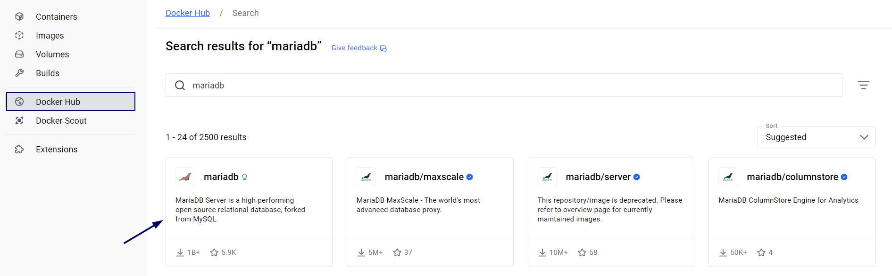

# Ejercicio 2: Servidor de base de datos

> **Autores**: Ángel Villabrille Fernández, Cristina Mellado Malacara.
> 

## 1.Abre Docker Desktop. Busca `mariadb` en la selección de imágenes. Selecciona la imagen oficial. Descárgala si no la tienes.

- Nos situamos en la pestaña `Docker hub`  y buscamos la imagen oficial en el buscador.



- Seleccionamos el botón pull para descargar la imagen. Se puede observar que se bajó correctamente.


- Nos dirigimos a nuestra pestaña `images` para hacer la comprobación de que se encuentra la imagen en la lista.


## 2. Despliega un contenedor utilizando esta imagen:

     *Características:*

    *Nombre del contenedor `bbdd`* 

    *Puerto: 3306 - debe poder conectarse externamente*

    *Utiliza un volumen llamado `datos-mariadb`* 

    *Usa las variables de entorno necesarias para que el usuario `root` tenga la password `root` , la base*       

    *de datos por defecto sea `base` , y se cree un usuario `daw` , conpassword `daw` .*

- Comprobamos la ruta para proceder a introducir los datos en nuestro contenedor.


- Seleccionamos la pestaña `volumes` y hacemos click en el botón create.


- Configuramos los datos.


- Comprobamos en Docker Desktop que se creó el contenedor y se está haciendo uso del volumen `datos-mariadb` .


## 3. Arranca el contenedor

- Pulsamos el botón de arrancar y comprobamos que funcionó con éxito


## 4. Accede a la base de datos usando una herramienta gráfica, como, por ejemplo `dbeaver` .Conéctate con el usuario `daw` . Crea una base de datos y alguna tabla.

1. Accedemos a `dbeaver` y pulsamos en nueva conexión.


- Seleccionamos nuestra base de datos `mariadb`


b. Me conecto exitosamente con el usuario `daw` .


c. Creamos una base de datos y una tabla.

- Tenemos que otorgarle permisos al usuario `daw` para que pueda crear base de datos y tabla, eso lo hacemos desde nuestro usuario `root` .


- Ahora que tenemos los permisos, volvemos a nuestro usuario `daw` , y creamos la base de datos `mi_nueva_base.`

```sql
CREATE DATABASE mi_nueva_base;
```


- Creamos una tabla llamada `usuarios`  y comprobamos que se creó correctamente.

```sql
CREATE TABLE usuarios (
    id INT AUTO_INCREMENT PRIMARY KEY,
    nombre VARCHAR(50) NOT NULL,
    email VARCHAR(100) UNIQUE NOT NULL,
    edad INT
);
```


## 5. Borra el contenedor.


## 6. Ver en Docker Desktop que el volumen que contiene los datos no se ha borrado.

- En la imagen se puede observar que no se eliminó el volumen `datos-mariadb`


## 7. Crear otro contenedor con un servidor de base de datos que use el mismo volumen. Llamar al contenedor `bbdd-2` . Comprobar que la base de datos y la tabla creada anteriormente siguen ahí.

- Creamos el nuevo contenedor


- Comprobamos que arrancó correctamente.


- Se comprueba que la base de datos y la tabla creada anteriormente siguen ahí.


## 8. Intenta borrar la imagen de `mariadb` ¿Qué sucede?

- Al intentar eliminar la imagen `mariadb` nos pone el siguiente mensaje:
    
    *Error al eliminar: La imagen mariadb:lts-ubi9 está en uso. Elimina el contenedor que la está usando y vuelve a intentarlo.*
    
    Esto sucede porque Docker no permite borrar una imagen si hay algún contenedor que la está utilizando. Para poder eliminarla, primero es necesario detener y borrar todos los contenedores que dependen de esa imagen.
    


## 9. Borra todo, volumen, imagen y contenedor.

- Eliminamos primero el contenedor: Para que posteriormente nos permita eliminar el volumen y después la imagen.


- Eliminamos el volumen.
    
    
    

- Eliminamos la imagen.


